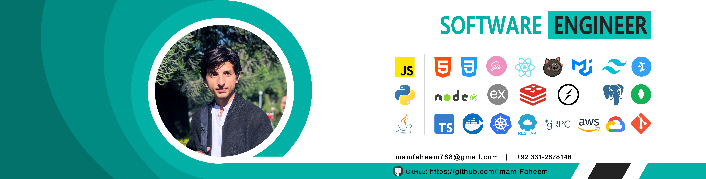

# Software Engineer | Product Builder | 

**2+ years building scalable products** • **Concept-to-revenue specialist** • **15-member team contributor**

🌐 [Portfolio](https://imam-faheem.vercel.app) | 📧 [imamfaheem768@gmail.com](mailto:imamfaheem768@gmail.com) | 💼 [LinkedIn](https://www.linkedin.com/in/imamfaheem) | 📍 Peshawar, Pakistan

---

## What I Bring to Your Team

**Product-First Engineer** → Built complete products from concept to paying customers  
**AI Innovation** → Currently developing intelligent agent systems for business automation  
**Full-Stack Expertise** → End-to-end ownership from React frontends to Node.js backends  
**Startup & Scale Experience** → Proven ability in both product development and optimization phases

---

## Key Achievements

### School Management System (Production Application)
*React, Next.js, Node.js, PostgreSQL*

**Live system at usemaktab.com processing 100 Million PKR annually for 1,000+ students**

- Designed and implemented core business logic modules supporting multi-tenant school operations
- Automated key workflows, reducing manual effort by 80%
- **Ongoing Maintenance:** Currently providing support and feature updates

### Food Delivery Multivendor Platform
*React Native, Next.js, GraphQL, Node.js, TypeScript, Apollo Client*

**Enterprise-grade food delivery ecosystem serving 6 applications with real-time tracking**

- **Architecture:** Built 6 applications - Customer/Rider mobile apps (React Native) and Admin dashboards (Next.js/React)
- **Backend & Features:** Developed Node.js GraphQL API with WebSocket real-time communication, Google Maps integration, JWT authentication with role-based access
- **Scale Impact:** 50,000+ lines of code with payment processing, commission management, analytics and multi-language support

---

## Core Skills

### Programming
  

**JavaScript (2+ years), TypeScript (1+ year), Python**

### Frontend
  

**React.js (2+ years), React Native, Next.js, Redux, TanStack, Apollo Client, UI Libraries, HTML5, CSS3**

### Backend
  

**Node.js (2+ years), Express, GraphQL, REST APIs, WebSocket, FastAPI**

### Databases & ORMs
  

**PostgreSQL (2+ years), MongoDB, MySQL, Sequelize, Mongoose**

### DevOps & Tools
  

**Git, GitHub Actions, Redis, Zustand, Docker (learning)**

### APIs & Integrations
**Google Maps API, Payment Gateway Integration, JWT Authentication, RBAC**

---

## Currently Learning

🤖 **AI Agent Architectures** → Advanced automation and decision-making systems  
⚡ **Performance Optimization** → Scaling applications for growing user bases  
☁️ **Cloud Infrastructure** → AWS/GCP advanced services and cost optimization  
🐳 **Docker** → Container orchestration and deployment

*"Building the future, one intelligent agent at a time"*

---

## Education

**Bachelor's in Computer Science** | University of Engineering & Technology Peshawar  
*Oct 2022 - Oct 2026* | Currently advancing theoretical knowledge while building real products

---

## What I'm Looking For

Currently **open to software engineering and product development roles** in:
- **High-growth companies** (Seed to Series C+) - Thrive in both product development and scaling phases
- **Product & Service companies** - B2B SaaS, fintech, edtech, healthcare tech
- **Remote-first teams** - Proven remote collaboration experience
- **Product-focused environments** - Where engineering drives business outcomes

**Ideal Role**: Software engineering position with product ownership, user impact focus, and growth opportunities

---

## Let's Build Something Amazing

📅 **Available for**: Technical discussions, product brainstorming, code collaboration  
💬 **Response time**: Within 12 hours  
🎯 **Collaboration style**: Product-minded, user-focused, results-driven  

---

  

*"Every line of code should solve a real problem for real people"*
